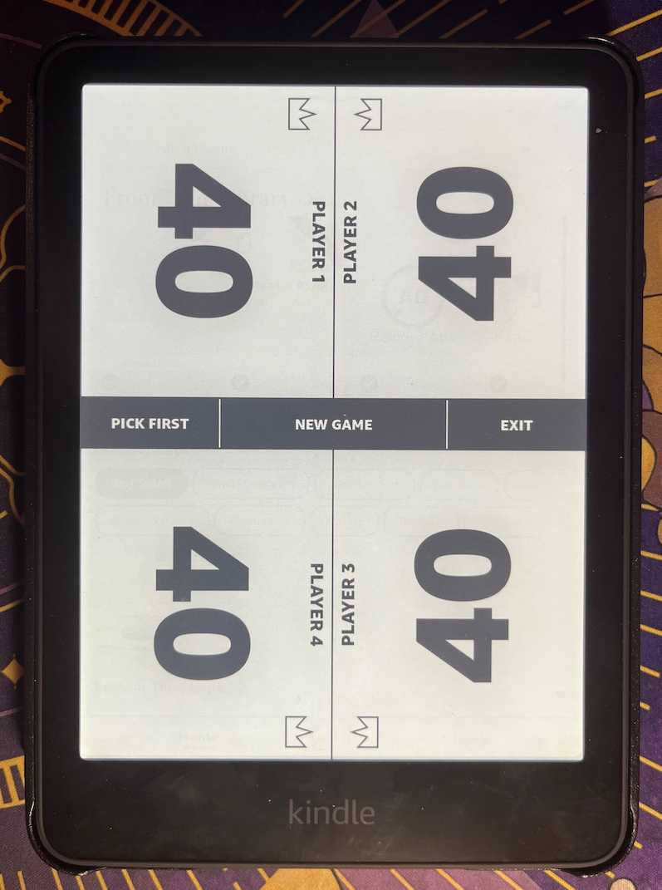

# MTG Commander Life Counter for Kindle

A local, offline four-player Commander life counter for jailbroken Kindle e-readers. The app is inspired by the speed and table readability of LifeTap, adapted into an original monochrome e-ink interface.

## On-device screenshot

<p align="center">
  
</p>

This is V1 running on Kindle hardware.

## V1 behavior

- Four players start at 40 life.
- Tap the seat-facing half of each player panel for −1/+1.
- Hold a life-control region for ±10 total.
- All four totals are rotated toward their tabletop seats.
- Tap a crown to assign or clear the unique Monarch player.
- `Pick First` chooses a random player different from the current selection.
- `New Game` confirms before resetting life and clearing First/Monarch.
- `Exit` saves state and closes the app.
- Relaunch restores the previous game.
- No cloud service, account, internet, or paid dependency.

## Architecture

KUAL is only the launcher. The gameplay surface is a native GTK+-2.0 application with a Kindle application-layer, no-chrome, full-screen window. Owning a real window is essential: the earlier `eips` spike only drew over Kindle Home and allowed touches to activate books and applications underneath.

```text
extensions/mtg-life-counter/
  config.xml
  menu.json
  bin/
    launch.sh
    mtg-life-counter       # cross-compiled ARM binary
  assets/
    first-player.svg       # original MIT-licensed source artwork
    first-player.png       # runtime image generated from the SVG
  data/                    # created at runtime; preserved by MTP updates
native/
  meson.build
  src/
    game.c                 # testable game behavior/persistence
    game.h
    main.c                 # GTK/Cairo/Pango UI and touch handling
  tests/
    run.sh
    test_game.c
design/
  mtg-life-counter-preview.html
```

KUAL exposes one direct row:

```text
MTG Commander Life Counter
```

## Host behavior test

```bash
native/tests/run.sh
python3 tests/test_menu_json.py
```

These tests verify game state, life adjustment, rotated touch mapping, persistence, and the one-row KUAL launcher. Only an actual Kindle can verify e-ink appearance, GTK window ownership, and touch behavior.

## Build target

Supported Kindle devices on firmware 5.16.3 and newer use the `kindlehf` target. Cross-compilation uses:

- KOReader `koxtoolchain` prebuilt `kindlehf` toolchain
- KindleModding unofficial Kindle SDK
- Meson/Ninja inside a local x86 Linux Lima VM on Apple Silicon macOS

Build the ARM package binary with:

```bash
scripts/build-kindle.sh
```

Install over a mounted Kindle volume or MTP with:

```bash
scripts/install-to-kindle.sh
```

The MTP updater preserves the Kindle's existing `data/` subtree rather than shipping or overwriting mutable game state.

## Install and acceptance test

Installation uses MTP because newer Kindles do not mount under `/Volumes` on macOS. After upload and KUAL restart:

1. Tap `MTG Commander Life Counter`.
2. Confirm a full-screen four-player board appears.
3. Tap blank areas and verify no Kindle content behind the app opens.
4. Test −1/+1 for all players.
5. Test exclusive Monarch selection and clearing.
6. Test `Pick First`.
7. Test `New Game` and both confirmation buttons.
8. Exit and relaunch to verify state persistence.
