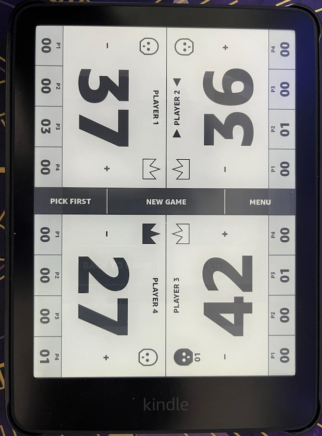

# MTG Commander Life Counter for Kindle

A local, offline four-player Commander life counter for jailbroken Kindle e-readers. The app is inspired by the speed and table readability of LifeTap, adapted into an original monochrome e-ink interface.

## On-device screenshot

<p align="center">
  
</p>

This is V2 running on Amazon Kindle Paperwhite hardware.

## Current development status

The screenshot above is the accepted V2 device build running on Kindle hardware.

- Four players start at 40 life.
- Tap the seat-facing half of each player panel for −1/+1.
- Hold a life-control region for ±10 total.
- All four totals are rotated toward their tabletop seats.
- Each player has four `P1`–`P4` commander-damage counters.
- Tapping commander damage adds one and subtracts one life; holding clears that
  source and refunds its tracked life.
- Poison starts as an outlined skull; tap activates/increments it and hold clears it.
- Tap a crown to assign/transfer Monarch; hold the active crown to clear it.
- `Pick First` chooses a random player different from the current selection.
- `New Game` confirms before resetting all V2 gameplay state.
- `Menu` provides live battery status, a front-light on/off toggle that restores
  the prior brightness, Back to Game, and immediate saving Exit.
- Pressing the Kindle sleep button turns off the front light and blocks game
  touches. Waking restores touch and restores the exact prior brightness only
  when the light was on before sleep. Exit always leaves the front light off.
- Relaunch restores the previous game.
- No cloud service, account, internet, or paid dependency.

## Architecture

KUAL is only the launcher. The gameplay surface is a native GTK+-2.0 application with a Kindle application-layer, no-chrome, full-screen window. Owning a real window is essential: the earlier `eips` spike only drew over Kindle Home and allowed touches to activate books and applications underneath.

```text
extensions/mtg-life-counter/
  config.xml
  menu.json
  bin/
    launch.sh
    mtg-life-counter       # cross-compiled ARM binary
  data/                    # created at runtime; preserved by MTP updates
native/
  meson.build
  src/
    game.c                 # testable game behavior/persistence
    game.h
    device.c               # Kindle battery/front-light LIPC adapter
    device.h
    layout.c               # shared draw/hit geometry and hold state
    layout.h
    main.c                 # GTK/Cairo/Pango UI and touch handling
  tests/
    run.sh
    test_game.c
    test_device.c
    test_layout.c
design/
  mtg-life-counter-preview.html
```

KUAL exposes one direct row:

```text
MTG Commander Life Counter
```

## Host behavior test

```bash
native/tests/run.sh
python3 tests/test_menu_json.py
```

These tests verify V2 state transitions, all 16 commander hit targets, rotated life controls, hold promotion, persistence migration, the battery/front-light adapter, and the one-row KUAL launcher. Physical Kindle acceptance has also confirmed e-ink appearance, GTK window ownership, touch behavior, live battery status, exact front-light restoration, and fail-closed sleep/wake handling.

## Build target

Supported Kindle devices on firmware 5.16.3 and newer use the `kindlehf` target. Cross-compilation uses:

- KOReader `koxtoolchain` prebuilt `kindlehf` toolchain
- KindleModding unofficial Kindle SDK
- Meson/Ninja inside a local x86 Linux Lima VM on Apple Silicon macOS

Build the ARM package binary with:

```bash
scripts/build-kindle.sh
```

Create the installable GitHub release ZIP with:

```bash
scripts/package-release.sh 2.0.0
```

The archive contains only `extensions/mtg-life-counter/`; runtime state and logs
are excluded. See [`CHANGELOG.md`](CHANGELOG.md) for V2 release notes.

Install over a mounted Kindle volume or MTP with:

```bash
scripts/install-to-kindle.sh
```

The MTP updater preserves the Kindle's existing `data/` subtree rather than shipping or overwriting mutable game state.

## Install and acceptance test

Installation uses MTP because newer Kindles do not mount under `/Volumes` on macOS. After upload and KUAL restart:

1. Tap `MTG Commander Life Counter`.
2. Confirm a full-screen four-player board appears.
3. Tap blank areas and verify no Kindle content behind the app opens.
4. Test life tap/hold for all players.
5. Test all 16 commander cells and their exact life refunds.
6. Test poison tap/hold for all players.
7. Test Monarch transfer and hold-to-clear.
8. Test First-player triangles and `Pick First`.
9. Test `New Game`, Menu input blocking, live battery percentage, front-light
   off/on restoration, Back, and immediate Exit.
10. With the front light on, press sleep/wake and verify light-off, blocked touch,
    and exact brightness restoration. Repeat with the light off and verify it
    stays off after wake.
11. Turn the front light on, press Exit, and verify the light turns off; relaunch
    to verify V1 migration and V2 persistence.
